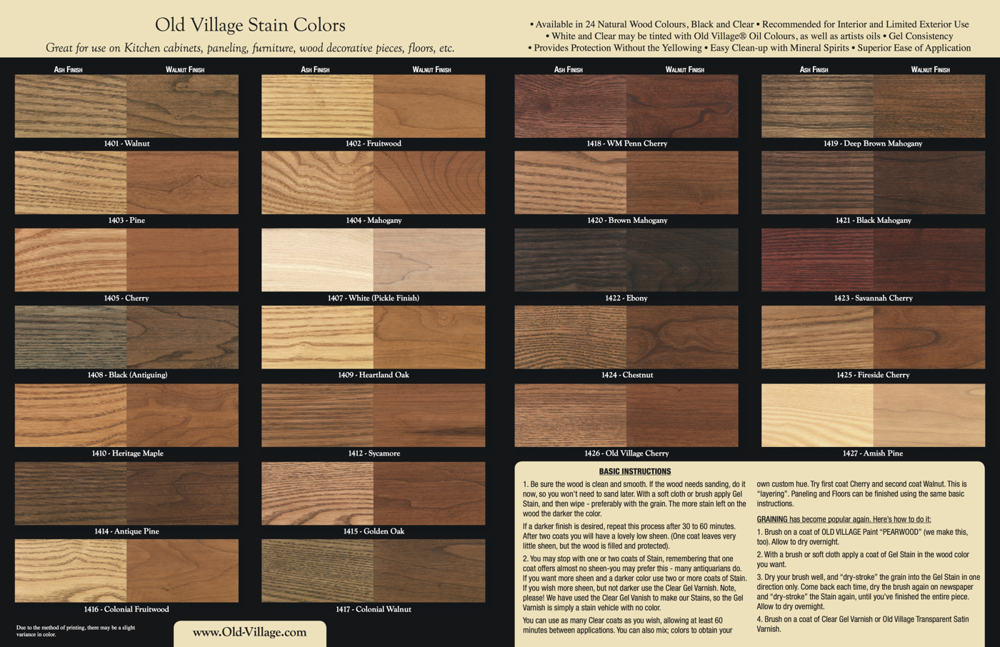
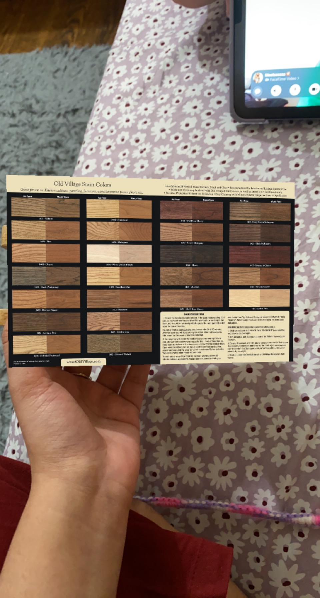
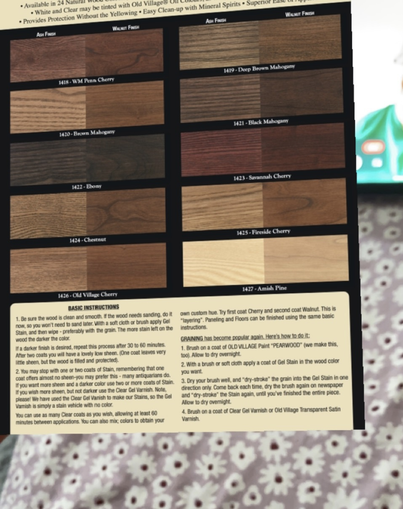

<div align="center">

  
  <h1>The Arch Lab</h1>
  
  <p>
    Digital Library For all architectural textures available in the market.
   
    Arch Lab is the app which scans on site textures and materials and gives you the available options in the market.

  </p>
  
  
<!-- Badges -->

</div>

<br />

<!-- Table of Contents -->
# :notebook_with_decorative_cover: Table of Contents

- [About the Project](#star2-about-the-project)
  * [Description](#dart-Description)
  * [Screenshots](#camera-screenshots)
  * [Features](#dart-features)
- [Getting Started](#toolbox-getting-started)
  * [Make Your Own Image Tracking App](#bangbang-prerequisites)
  * [Scan the Code here to try out the texture scan filter](#gear-installation)


  

<!-- About the Project -->
## :star2: About the Project

<!-- Description -->
### :dart: Description
Architectural materials play important role into the process of design. When it comes to new and innovative materials, the professional should know all the details about them. 

In order to find new materials available in the market, architects work with various production and suppling companies.

By the time new materials and textures get into the research, architects/ interior designers need to have the knowledge about it.


<h2> Pain Points</h2>

First and most important factor for material selection as an architect and working in the field of designing it is always necessary to have knowledge about various materials and techniques available in the market. 

To gather information about vernacular materials and products for construction, designers usually go out in the market and do research on them.


Pain point in the entire process is to go on site and try these materials every time with having less knowledge about them will makes the process slow and tiring.


<h2> Goal of the Study</h2>
In order to do research about materials and how they will look on actual site, a product with a vision of textures and multiple options for finishing materials which looks real will help the designers to solve the problem of selections and making right decision in time. 


The product should have enough materials according to the real-world designs and actual materials properties with some effects in order to make the selection process easy.


<h2> Interview Subjects</h2>

Architects

Interior designers

On-site executioners

Raw material manufactures

Furnishing companies

Material vendors

<h2> Insights from Interviews</h2>

Professionals like architects and interior designers do their research every time they use any new material available from manufactures.

Manufactures from various areas provide their product flyers and sample products to be installed on the site for comparison perspective.

They both would like to connect through a single product in which they can both put their thoughts and gain knowledge about new materials available in the market.

Architects emphasize on having real looking products and their details so that they do not have to put them on site every single time.

<!-- Screenshots -->
### :camera: Screenshots

<div align="center"> 
  
  
  
  
  
</div>


<!-- Features -->
### :dart: Features

- Feature 1: 
When the Live material will be scanned by the app, it will show the detailed information about exsisitng materials in the market.
- Feature 2:
By looking the material library you can also see the application methods and how to preserve it for long time use.
- Feature 3:
In the app you can also look for the vendor details and the companies which manufactures the materials and textures.


<!-- Env Variables -->
### :key: Environment Variables

To run this project, you will need to add the following environment variables to your .env file

`API_KEY`

`ANOTHER_API_KEY`

<!-- Getting Started -->
## 	:toolbox: Getting Started
  To getting started with the Unity hub i created the base tamplate for AR Core and made it useful for the ios version.
  After selecting appropriate options for playes settings and getting the AR Core packages into the Unity scene i created the base material which can be     scanned and replaced with the detailed options available in the market.
  
  The Version for Unity Hub : 2021.3.15f1 
  
  Project type: AR Core
  
  Assests used from: Unity Asset Store
  
  X-code: Version 14.2 (14C18)
  
  Lens-Studio: AR Marker Template 
 
<!-- Make Your Own Image Tracking App -->
### :bangbang: Prerequisites

This project uses Unity Hub as a AR Core template.

Steps to Make the AR Image Tracking Project.

```bash
Create New Project with AR Core
```

```bash
Open Player Settings and Install XR Plugin Management 
```

```bash
Select ARKit Plugin
```

```bash
Import AR Foundation packages from Package Manager
```

<!-- Installation -->
### :gear: Installation

Install my-project with npm

```bash
  Make AR Session Origin as your base and add the texture which needs to be scan.
```
 
```bash
 Put the replaced object and build the scene to X-Code
```

```bash
It can also be Created into Lens Studio under Maker Image Target Settings.
```

<!-- Scan the Code here to try out the texture scan filter -->
## :gem: Acknowledgements


 

